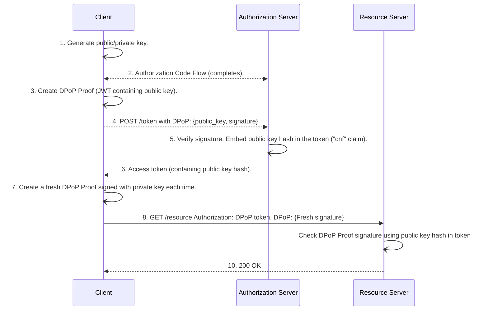

## Access tokens

The OAuth 2.0 RFC 6749 defined the authorization framework and explained how we can obtain access tokens. Additionally, a separate RFC 6750 defined Bearer tokens and how to use them - transmit in HTTP requests. Bearer tokens are a type of access token. Anyone who holds a Bearer token can use it — no cryptographic proof of ownership required. 

Bearer Tokens have over a decade of proven track record, but they have a fundamental weakness: if stolen, the attacker can use them. This is the motivation behind sender-constrained tokens. A client must prove possession of a cryptographic key bound to the token.

In this article, we will unpack the sender-constrained tokens and compare them with the bearer tokens:
- Bearer tokens
- Sender-constrained tokens:
  - DPoP (Demonstrating Proof of Possession) —  - 2023
  - mTLS (Mutual TLS) Certificate-Bound Access Token — RFC 2020

## How DPoP (Demonstrating Proof of Possession) works

The client generates a public/private key pair. 
Private key never leaves the client

