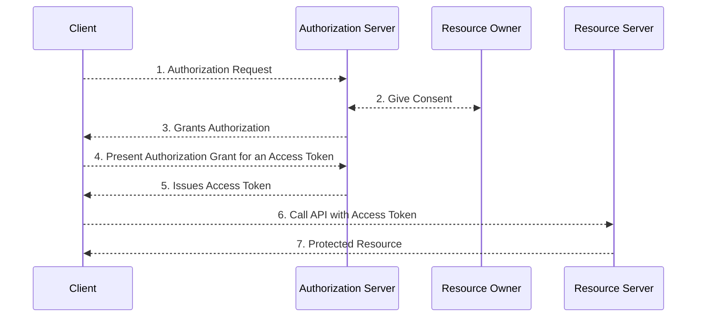
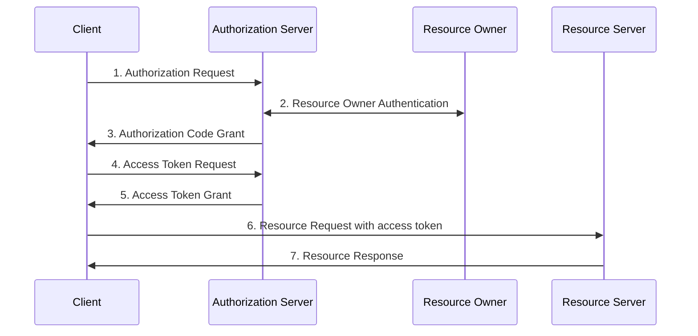
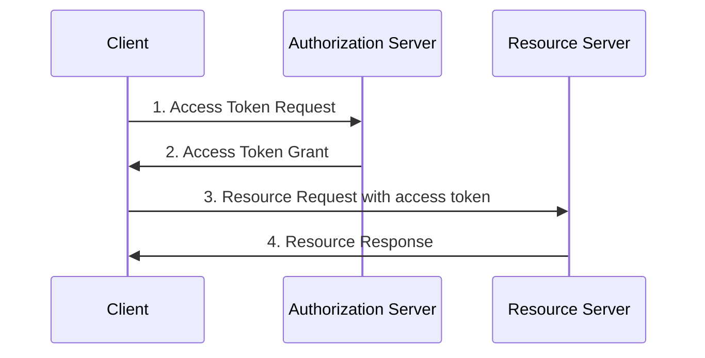
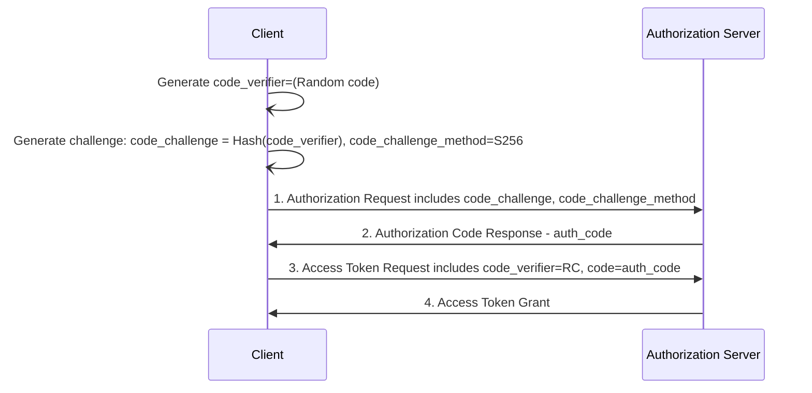
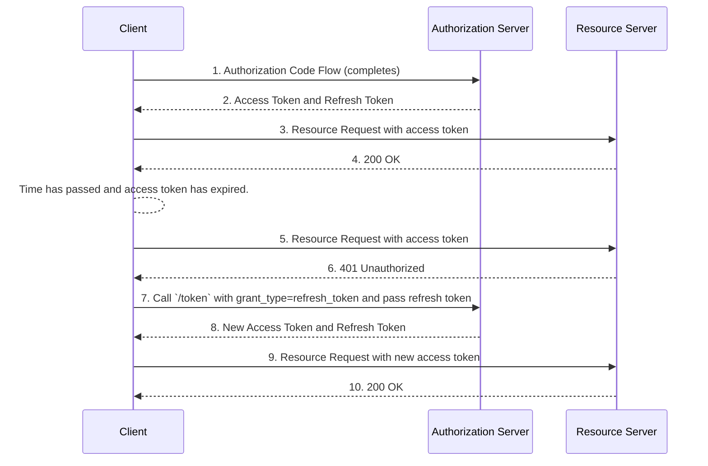

## History

Before OAuth 2.0, giving access to third party applications to a requested resource, meant we needed to type our credentials - username and password, which are stored on the 3P side and used as an action which was performed on our behalf. 

This is a problem, firstly, because they can be used to access all kinds of resources, not a limited scope of them, no revocation was possible, and secondly, third party software stored those in plaintext. If the third-party software was compromised, our data was also at risk. 

With OAuth, we solve this problem in a simple matter - use an "access token" instead of a password. But you would say - "well a token can be stolen, just like a password". The core idea is that this token is issued to be scoped, time-limited and revocable credential, issued by an authorization server. This is called "delegated authorization without credential sharing".

An important remark is that OAuth 2.0 is not designed for authentication purposes. It should be used for authorization - permissions, scopes, and answering questions like "is your token scoped to do a particular thing?". OIDC is built on top of OAuth 2.0 for authentication purposes. This article will include OIDC-related attributes in the authorization flows, however, a separate deep dive of OIDC is to follow.

## OAuth 2.0 Authorization Framework of specifications 

OAuth 2.0 is the industry-standard protocol for authorization. The OAuth 2.0 authorization framework enables a third-party application to obtain limited access to an HTTP service, either on behalf of a resource owner by orchestrating an approval interaction between the resource owner and the HTTP service, or by allowing the third-party application to obtain access on its own behalf.
1. [OAuth 2.0 (RFC 6749)](https://datatracker.ietf.org/doc/html/rfc6749) - The OAuth 2.0 Core - 2012
2. [OAuth 2.0 Bearer (RFC 6750)](https://datatracker.ietf.org/doc/html/rfc6750) - Bearer Token Usage - How to "use" tokens (Authorization header, etc.) - 2012
3. [OAuth 2.0 Assertions (RFC 7521)](https://datatracker.ietf.org/doc/html/rfc7521) - Client Authentication and Authorization Grants - 2015
4. [OAuth 2.0 JWT Profile (RFC 7523)](https://datatracker.ietf.org/doc/html/rfc7523) - JWT Profile for Client Authentication and Authorization Grants - 2015
5. [PKCE (RFC 7636)](https://datatracker.ietf.org/doc/html/rfc7636) - Proof Key for Code Exchange by OAuth Public Clients - Prevents authorization code interception - 2015
6. [OAuth 2.0 Token Exchange (RFC 8693)](https://datatracker.ietf.org/doc/html/rfc8693) - OAuth 2.0 Token Exchange - 2020
7. [OAuth 2.1 Draft](https://datatracker.ietf.org/doc/draft-ietf-oauth-v2-1/) - The OAuth 2.1 Authorization Framework

## OAuth 2.0 Roles
OAuth 2.0 RFC defines four roles:



- **Resource Owner** - An entity capable of granting access to a protected resource. When the resource owner is a person, it is referred to as an *end-user* (user who can click on yes/no when prompted). A resource owner is "any entity capable of delegating access to a protected resource". **With OAuth and OIDC the client does not impersonate the resource owner, but works on behalf of the resource owner.** The resource owner isn’t asking for permission to the resource; he or she already has that permission. Instead, is asking for permission for the _client_ to access the resource on behalf of the owner.
- **Resource Server** - The server hosting the protected resources, capable of accepting and responding to protected resource requests with access tokens.
- **Client** - A third-party *application* making protected resource access requests on behalf of the resource owner and with its authorization. The term "client" does not imply any particular implementation characteristics (e.g., whether the application executes on a server, a desktop, or other devices).
	- OIDC Note: OIDC clients are also known as RPs or "*relying parties*". That’s because they rely on an outside service (the authorization server) to vouch for the identity of a user: an RP requests authentication for a user, but does not actually perform the authentication itself. 
- **Authorization Server** - The server issuing access tokens to the client after successfully authenticating the resource owner and obtaining authorization.
	- OIDC Note: The authorization server, in turn, is also referred to as the OP (*OpenID Provider*).

> The authorization server and resource server may be the same server or separate. 
> A typical pattern is one authorization server (e.g., Google) issuing tokens to multiple APIs (Gmail, Drive, Calendar).

## Endpoints

OAuth 2.0 in essence has three endpoints in the orchestration of access grant and token retrieval - `/auth`, `/token`, `/callback`.

| Endpoint               | Location              | Role                                               | HTTP Method           |
|------------------------|-----------------------|----------------------------------------------------|-----------------------|
| Authorization Endpoint | Authorization Server  | Interact with resource owner (end user) to get consent | GET (MUST), POST (MAY)|
| Token Endpoint         | Authorization Server  | Exchange grant for access token                    | POST (MUST)           |
| Redirection Endpoint   | Client                | Receive response from authorization server (callback) | —                     |

Authorization Endpoint and Token Endpoint require TLS.
Confidential Clients (i.e. server-side applications) MUST authenticate at the Token Endpoint.

## Grant Types
In OAuth 2.0, we have the following grant types, often referred to as different OAuth 2.0 flows:
- Authorization Code Grant - exchange an authorization code for an access token
- Authorization Code Grant with PKCE 
- Client Credentials Grant
- (deprecated) Implicit Grant
- (deprecated) Resource Owner Password Grant

We will take a look at the first three in more detail. The implicit and password grant are deprecated and have major security considerations. They have been removed in the OAuth 2.1. 

### Grant Types: Authorization Code Grant
Starting the with the most common OAuth grant type. 



Let's see the endpoints for `/auth`, `/callback` and `/token`.

#### Authorization Request

```http
GET /auth?client_id=1234&redirect_uri=https://client-url/callback&response_type=code&scope=photo&state=456789 HTTP/1.1 
Host: authorization-server-url
```

We can see that the first request contains interesting information:
- `client_id` - its unique identifier
- `redirect_uri` - the callback url after a successful authentication and authorization grant of the resource owner
- `response_type` - code, meaning we are in the authorization code grant
- `scope` (optional) - what kind of scope of resources we request access to
- `state` (optional) - random string tying the auth request to the following callback request

Note: For OIDC ID Tokens we can also have the following optional parameter to protect against replay of ID tokens.
- `nonce` (optional) - stops replay attacks on ID tokens (OIDC tokens), which gets embedded as a claim of the ID token.

#### Callback
After the request has been authorized, we are redirected to the `redirect_uri` parameter of the auth request:

```http
GET /callback?code=h4928t2hf&state=456789 HTTP/1.1
Host: client-url
```

This request contains two parameters:
- `code` - authorization code issued by the authorization server. It will be used to be exchanged for a token. 
- `state` - state value from the authorization request to tie these two requests together.

#### Token request
The Client is able to request an access token from the Authorization Server by exchanging the code it received.

```http
POST /token HTTP/1.1
Host: authorization-server-url

client_id=12345&client_secret=SECRET&redirect_uri=https://client-url/callback&grant_type=authorization_code&code=h4928t2hf
```

We can see two new parameters 
- `client_secret` - a secret value assigned to the client by the authorization server during the initial registration. This value authenticates the client to the authorization server. This was done in the beginning when the client was registered to the authorization server as a one-time action.
- `grant_type` - always set to authorization_code for the authorization code grant.

After this request we can receive 
```json
{
  "token_type": "Bearer",
  "expires_in": 86400,
  "access_token":"irngrngw",
  "scope": "photo",
  "refresh_token": "eCqC6CI9bFG"
}
```

The client has a valid token that can now be used for resource request from the resource server.

```http
GET /photo_info HTTP/1.1
Host: resource-server-url
Authorization: Bearer irngrngw
```

#### Security highlights:

- The state parameter is CSRF protection. The client generates a random string per request and verifies it matches on callback. It is also used as an application state.
- Authorization codes are single-use. If a second use is detected, all tokens issued with that code should be revoked.
- Authorization codes should have a maximum lifetime of 10 minutes.
- The Token Request happens over a back-channel (server-to-server), so the access token is never exposed to the browser.

### Grant Types: Client Credentials Grant
A Grant Type for machine-to-machine (M2M) communication where no user is involved. Used when the client accesses its own resources.



Refresh Token SHOULD NOT be issued — the client can always obtain a new token with its own credentials, so a Refresh Token serves no purpose.

### Grant Types: Authorization Code Grant + PKCE

PKCE (Proof Key for Code Exchange) is an extension to OAuth 2.0 to prevent authorization code interception attacks. It becomes **mandatory** for all client types in OAuth 2.1.

Let's first check the difference of clients - we just covered the confidential clients. They are back-channel clients (servers), which are private so they can store the `client_secret` securely. An example is a server-side application. 

However, we also have public clients - SPA, mobile apps. We have access to the applications' source code. The browser is a front-channel client which is public. With PKCE we can secure public clients. With the PKCE we can secure both public and confidential clients. That is why this hardened solution is chosen in the OAuth 2.1.

What happens if you have a mobile app, and a malicious user is able to register another app with the same `redirect_uri` scheme? Your app makes an authorize request, an authorization code is returned. But the malicious app receives the authorization code grant because it has configured the `redirect_url` to be the same and achieves interception. Now, the malicious app can make the `token` request and steal the token intended of the original app. This is an example of authorization code interception attack - inter-app URL scheme hijacking.

PKCE can help prevent it. Here is how it works:



Let's see interaction with the endpoints for `/auth`, `/callback` and `/token`.

#### Authorize
Before redirecting the user to the authorization server, the client first generates a secret code verifier and challenge.

The code verifier is a cryptographically random string using the characters A-Z, a-z, 0-9, and the punctuation characters -._~ (hyphen, period, underscore, and tilde), between 43 and 128 characters long.

Once the client has generated the code verifier, it uses that to create the code challenge. For devices that can perform a SHA256 hash, the code challenge is a BASE64-URL-encoded string of the SHA256 hash of the code verifier.

Example:
```bash
code_verifier=cHH3doNqAMNWXoqjLO0OvTn89enL_SK--XbrwPiHmWmIsWHYN
code_challenge=base64url(sha256(code_verifier)) # (l9jC5bcXvHLQgUaFFmYC-_k5FXhUZhACvoniOimvEL4)
```

The client stores the code verifier. It will be needed later.

Now it builds the authorization URL:

```http
GET /auth?
  response_type=code
  &client_id=1234
  &redirect_uri=https://client-url/callback
  &scope=photo
  &state=456789
  &code_challenge=l9jC5bcXvHLQgUaFFmYC-_k5FXhUZhACvoniOimvEL4
  &code_challenge_method=S256 HTTP/1.1 
Host: authorization-server-url
```

#### Callback

Callback remains as is.

```http
GET /callback?code=h4928t2hf&state=456789 HTTP/1.1
```

#### Token
Now we're ready to exchange the authorization code for an access token.

```http
POST /token HTTP/1.1
Host: authorization-server-url

grant_type=authorization_code
&client_id=1234
&redirect_uri=https://client-url/callback
&code=h4928t2hf
&code_verifier=cHH3doNqAMNWXoqjLO0OvTn89enL_SK--XbrwPiHmWmIsWHYN
```

The authorization server will check whether the verifier matches the challenge that was used in the authorization request. This ensures that a malicious party that intercepted the authorization code will not be able to use it.

And we receive the response:
```json
{
  "token_type": "Bearer",
  "expires_in": 86400,
  "access_token": "xUqdhyQT0gXipd5qKtk3V0SADQETT1rBU0kVH_EvQwPxaHmPU5TuA_sL8EgusBbdhidSmu5a",
  "scope": "photo",
  "refresh_token": "pIxkNFutVcf6_LRk4wLNx6wP"
}
```

## Access Tokens and Refresh Tokens

### Access Tokens

Access tokens are credentials which are used for accessing protected resources. They have scope, lifetime and other access attributes. 

As we saw above in the token response endpoints the access token format is a string which the Authorization server can understand. It is not a JWT. OAuth does not define the format of the token. In practice, many access tokens can be opaque tokens - random strings with no decodable meaning. But they can also be JWTs - base64url encoded tokens, which have a payload with claims containing data. This is an implementation detail.

### Refresh Tokens
The access tokens are short lived. When an access token is issued, there can optionally be issued an additional token `refresh_token`. This token can only be used between the Client and Authorization Server to recreate a new `access_token`.

After we have received a `refresh_token` and an `access_token`, there is no further user interaction involved in order to issue a new `access_token`. The Client uses the `refresh_token` and obtains new pairs of `access_token` and `refresh_token` from the Authorization server. Think of it as completing the initial "user approval" via Authorization Code Grant, then being able to repeat token renewal over a back-channel without the user involvement.



However, allowing unlimited refresh would make the risk of a leaked Refresh Token permanent. In practice, limits are almost always applied:

| Limitation Method        | Description                                                                 |
|-------------------------|-----------------------------------------------------------------------------|
| Expiration              | Refresh Token expires after a set period (e.g., 30 or 90 days); user must re-login |
| Refresh Token Rotation  | Each use replaces the Refresh Token with a new one; old token is immediately revoked |
| Maximum Use Count       | Refresh Token expires after a specified number of uses                       |
| Absolute Lifetime       | Refresh Token expires a fixed time after initial issuance, regardless of renewal activity |

### Refresh Token Rotation
Refresh tokens can potentially be stolen as well. We need a mechanism to protect ourselves from refresh token theft. If an attacker steals a refresh token, he/she can request an access token using it and gain access.
Implementing refresh token rotation can help us mitigate the damage of refresh token theft.

Refresh tokens are single-use: If a refresh token is used, it immediately becomes invalid and a new one is returned. If an old refresh token is used (meaning second attempt, potential malicious user), then we invalidate all issued access tokens and refresh tokens and the resource owner needs to go through the authorization flow to get new valid ones.  

## Refs
- https://oauth.net/2/
- https://dev.to/kanywst/rfc-6749-deep-dive-understanding-oauth-20-design-decisions-from-the-specification-2amb
- https://labs.detectify.com/writeups/account-hijacking-using-dirty-dancing-in-sign-in-oauth-flows/#explanation-of-different-oauth-dances
- https://www.oauth.com/playground/authorization-code-with-pkce.html
